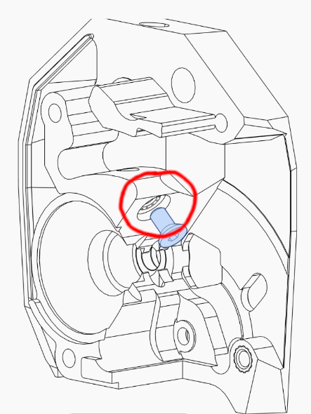

# Formbot Trident Build Guide

This document provides some guidance for building a Formbot Voron
Trident kit.

This guide is a community effort based on support from the Voron community
and from Formbot.  It is not an official product of the Voron Design
group or Formbot3d.

Please help us make it better by opening issues or PRs on github.

# Versions of the kit

This guide focuses on one specific version of the Formbot Voron Trident
kit, as sold in November 2024.

If you build a different version, please expand the guide to include
any info or instructions that differ.

    
"VORON Trident R1 Pro CoreXY 3D Printer Kit with Best Quality Parts" (ordered 2024-11-18)

Advertised features:
* Tap leveling sensor
* Filament runout detector
* LED chamber illumination
* Nevermore air filter
* PT1000 temperature sensor
* DLC hard-wearing gear
* 3 in, 6 out PCB
* Brass wire brush
* EBB SB2209 CAN (RP2040)
* EBB SB0000 CAN
* Metal movable hinge
* Bakelite isolation column
* HDMI 5" touch screen
* Stealthburner + CW2
* Manta M8P + CB1 motherboard
* Famous MOONS motors
* Premium silicone heating pad with integrated thermal fuse
* High quality double sided magnetic flexible PEI sheet
* Genuine Gates belts
* 440C stainless steel linear guide rails
* Precision machined cast aluminum plate

Differences from mainline Voron Trident:
* Bakelite spacers under the bed instead of M4 thumb nuts
* CAN toolhead board
* Umbilical toolhead wiring instead of cable chains

Noteworthy details:
* Uses standard microswitch XY endstops, not hall effect

# Tools

* A nice set of metric hex keys, e.g. Wera 950/9 or Wiha 26390.  You need 1.5 mm, 2 mm, 2.5 mm, 3 mm, and 4 mm.
* Phillips screwdriver, P0 size
* Flush cutters
* straight edge or ruler
* machinist's square or 123 blocks (for squaring the frame)
* clamps (for squaring the frame)
* measuring tape (for checking diagonals when squaring the frame)
* Threadlocker
* Isopropyl alcohol
* Grease, super lube is a good alternative, spray white lithium grease is another good option (e.g. <https://www.wd40.com/products/white-lithium-grease/>).

# The build process

## Documentation

These build instructions will reference the following manuals:
- [The Voron Trident Assembly Manual](https://github.com/VoronDesign/Voron-Trident/blob/main/Manual/Assembly_Manual_Trident.pdf)
- [The Stealthburner Assembly Manual](https://github.com/VoronDesign/Voron-Stealthburner/raw/main/Manual/Assembly_Manual_SB.pdf)
- [The Voron Tap Assembly Manual](https://github.com/VoronDesign/Voron-Tap/blob/main/Manual/Assembly_Manual_Tap.pdf)
- [Voron Tap r8 errata](https://github.com/VoronDesign/Voron-Tap/blob/main/Manual/R8_errata.md)
- [EBB SB2209 CAN](https://github.com/bigtreetech/EBB/blob/master/EBB%20SB2209%20CAN%20(RP2040)/Build%20Guide/EBB%20SB2209%20CAN%20V1.0%EF%BC%88RP2040%EF%BC%89Build%20Guide_20240626.pdf)

## Build sequence

### Frame, rails, gantry

| Manual               | Pages   | Comment
|----------------------|---------|---
| Voron Trident        | 1-21    | Assemble the frame.  It can be a little difficult to tell the different extrusions apart, the holes (tapped and not) can be a hint.
| Voron Trident        | 22-32   | Assemble the front idlers and AB drive frames.
| Voron Trident        | 33-39   | Assemble AB drives.
| Voron Trident        | 40-47   | Mount the front idlers and AB drives on the frame.  Note that this step uses seven M5 T-nuts and one M3 T-nut.
| Voron Trident        | 48      | This kit uses microswitch endstops, no hall effect endstops, so use the part `[a]_y_endstop_housing.stl` instead of the `[a]_y_endstop_bumper.stl` shown in the manual.
| Voron Trident        | 49-50   |
| Voron Trident        | 51      | The parts needed here are `z_rear_extrusionbracket_left.stl` and `z_rear_extrusionbracket_right.stl`.
| Voron Trident        | 52-56   |
| Voron Trident        | 57-59   | The manual shows 8 M3 T-nuts, but on the 350 mm machine 10 fit and there are plenty of spares in the Formbot kit.  Leave two adjacent empty holes at the center of the rail, then move out from there skipping every other hole as described in the manual.  Do whatever makes sense for your size of printer.
| Voron Trident        | 60-63   |
| Voron Trident        | 64      | This kit uses the 3-hole part for a generic cable chain, `z_carriage_rear_3hole.stl`.
| Voron Trident        | 65      | This part is `z_stepper_rear.stl`.
| Voron Trident        | 66-78   |
| Voron Trident        | 79      | The ACME nuts come screwed on to the lead screws, unscrew them before mounting them to the Z carriages.
| Voron Trident        | 80-90   | Assemble the three Z joints.
| Voron Trident        | 91      | Assemble the four feet.  The parts here are `corner_a_x2.stl`, `corner_b_x2.stl`, `[a]_corner_baseplate_a_x2.stl`, and `[a]_corner_baseplate_b_x2.stl`.  Make sure you match the "a" corner pieces with the "a" the baseplates, and "b" with "b".  Don't over-tighten the screws.
| Voron Trident        | 92-97   | Mount the feet to the frame.  Be careful to orient them correctly.
| Voron Trident        | 98-109  | *Loosely* assemble the XY joints - do not tighten the four M5x40 bolts yet.
| Voron Trident        | 110-111 | On the 350 mm kit, the "E Extrusion" is the 430 mm one: the shortest of the three remaining extrusions that's *longer* than the one remaining linear guide.  When mounting the linear rail to the extrusion, use as many M3 T-nuts as will fit using the "every other hole" pattern.  Seat all the M3x8 SHCSs in their T-nuts loosely, then tighten them starting from the center of the rail and working your way out to the ends.
| Voron Trident        | 112-113 | After seating the E Extrusion in the XY Joints, tighten all the screws in the XY Joints.  Make sure the screws holding the GT2 20-tooth idler gears are loose enough that the gears spin freely.
| Voron Trident        | 114     | The two missing bolts are for the endstop switches. Since they'll be placed differently in this kit you can the two screws here.
| Voron Trident        | 115     | The Formbot kit uses a toolhead umbillical, so it does not need the XY Cable Bridge.  Install two M5x10 BHCS in the right XY Joint, just like the left one has.
| Voron Trident        | 116-119 |
| Voron Trident        | 120-121 | Study the belt routing instructions for when we route the belts in the next few pages.
| Voron Trident        | 122-123 | Skip these pages, this kit uses Tap instead of the default Voron Trident X carriage.
| Voron Trident        | 124-130 | Route the A and B belts, and leave them hanging loose in front of the X rail.  This part is a bit fiddly.
| Voron Trident        | 131-133 | Skip these pages, this kit uses Tap instead of the default Voron Trident X carriage.
| Voron Trident        | 134     | Check your work.
| Voron Trident        | 135-137 | Skip these pages, this kit uses Tap instead of the default Voron Trident X carriage.

### TAP

| Manual               | Pages   | Comment
|----------------------|---------|---
| Voron TAP            | 1-17    | Read the [Voron Tap Assembly Manual](https://github.com/VoronDesign/Voron-Tap/blob/main/Manual/Assembly_Manual_Tap.pdf) **AND** [Voron Tap r8 errata](https://github.com/VoronDesign/Voron-Tap/blob/main/Manual/R8_errata.md).
| Voron TAP            | 18      | Use the Voron project's printed [MGN9 Assembly Tool](https://github.com/VoronDesign/Voron-Tap/blob/main/STLs/MGN9_Assembly_Tool.stl) rather than the similar part that comes with Formbot's kit.  Formbot's part is too fat and causes some inconvenience when reinstalling the carriage onto the rail later.
| Voron TAP            | 19-21   |
| Voron TAP            | 22-24   | Per the errata (_you did read the [errata](https://github.com/VoronDesign/Voron-Tap/blob/main/Manual/R8_errata.md), right??_) the threaded inserts are installed slightly differently.
| Voron TAP            | 25      |
| Voron TAP            | 26      | This kit uses the "Optical PCB" option.
| Voron TAP            | 27      | Per the errata, the two M3x6 FHCS that thread in to the `Tap_Front` part at an angle may be replaced with magnets, e.g. if your screws are non-magnetic. I use FHCS and it's working fine, but you do you.  
| Voron TAP            | 28      | M3x10 BHCS may be a bit on the short side, substitute M3x12 BHCS if necessary.
| Voron TAP            | 29      | Per the errata we use M3x6, M3x12, and M3x16 SHCS to attach the rail (with a threaded insert as a spacer on the M3x16).  I had trouble with the rail coming loose, so i added a drop of blue Loctite on each of these screws and snugged them down tightly, and that fixed it.  As with all rails, tighten from the center out.
| Voron TAP            | 30      | The 2024-06-23 and 2024-11-23 kit uses a "Trident style" X-axis microswitch. The switch and pigtail is labeled "TO CAN-Endstop" and is attached using M2x10 self tapping screws included with the kit.
| Voron TAP            | 31      | Install 2x M3 nuts to the back side of the Center to hold the belt covers (see Errata).  Run the belts through the slots in the center and out the front.  Attach the Center to the MGN12 linear rail of the X axis, pulling the belts snug as you do so.  Attach the printed belt covers from the Errata using M3x8 BHCS into the M3 nuts installed earlier.  This video is helpful: <https://www.youtube.com/watch?v=mJNCn72lQpU>
| Voron TAP            | 32      | If there is not sufficient clearance to install the MGN9H carriage onto its rail from the top, temporarily remove the lowest rail screw (the carriage stop, with the heat-set insert spacer) and install the carriage from the bottom, then reinstall the carriage stop screw.  
| Voron TAP            | 33      |

### Stealthburner toolhead

| Manual               | Pages   | Comment
|----------------------|---------|---
| Voron Stealthburner  | 1-10    |
| Voron Stealthburner  | 11      | BigTreeTech supplies an alternative version of this part but I think the stock Voron part works better. Note that one of the heat-set inserts is seated *below* the surrounding surface: 
| Voron Stealthburner  | 12-13   | Install the heat-set insert, including the two optional ones for the toolhead PCB.
| Voron Stealthburner  | 14      | This kit will use the [`CW2 Cable Bridge.STL`](https://github.com/bigtreetech/EBB/blob/master/EBB%20SB2240_2209%20CAN/STL/CW2%20Cable%20Bridge.STL) part from the BigTreeTech/EBB repo.  Add two heat-set threaded inserts: 
| Voron Stealthburner  | 15-17   | The BMG idler assembly may consist of three/four parts like the Voron manual shows, or it may consists of just two parts. As long as the axle snaps tightly in to the guidler and the gear spins freely and without wobble it's probably ok. If you have problems with the axle popping loose from the guidler, carefully place a drop of cyanoacrylate adhesive (Super glue) in the two places where the axle snaps into the guidler. Be careful not to glue the gear to the axle!  
| Voron Stealthburner  | 18      |
| Voron Stealthburner  | 19      | You can use the end of the gear shaft to gently press the bearings into place.
| Voron Stealthburner  | 20      | The manual calls for M3x6 FHCS here.  You can optionally use M3x4 FHCS, but M3x8 is too long and will interfere later.
| Voron Stealthburner  | 21      | For this kit this is one solid part so there's nothing to line up. 
| Voron Stealthburner  | 22-27   |
| Voron Stealthburner  | 31      | Use the [`CW2 Cable Bridge.STL`](https://github.com/bigtreetech/EBB/blob/master/EBB%20SB2240_2209%20CAN/STL/CW2%20Cable%20Bridge.STL) that you prepared earlier. The M3x20 screw will be too long. An M3x8 screw will work just fine.
| Voron Stealthburner  | 34      | Because the PCB will take up a bit more space use [Cable Cover For PCB](https://github.com/bigtreetech/EBB/blob/master/EBB%20SB2240_2209%20CAN/STL/Cable_Cover_For_PCB_V1.1.STL) instead. It is possible to fit the standard one, however the heatsink will be touching the cover. FIXME: use the one with the fan instead
| Voron Stealthburner  | 37      | The part you need may not look like the images from the manual. If you use a V6 hotend you won't have the holes at the top.
| Voron Stealthburner  | 38      | The PCB has an ADXL345 sensor built in so the two additional heat inserts are not needed.
| Voron Stealthburner  | 39      | If you have a V6 hotend then [this video](https://youtu.be/3eYIfBfV9SI?feature=shared) explains how to set it up.
| Voron Stealthburner  | 42      | If you have a V6 hotend skip this step.
| Voron Stealthburner  | 43      | The kit comes with two pieces of PTFE tubing. Use the one with a smaller inner diameter for this part. If you have a V6 hotend then remove the plastic retaining ring, insert the PTFE tube, and then put the ring back in place.
| Voron Stealthburner  | 49      | You may need to remove some material that's in the way to fully insert the piece.
| Voron Stealthburner  | 53      | Rotate the fan 90º counter clockwise to have enough wire length to reach the PCB later.
| Voron Stealthburner  | 54-55   | If you have a V6 hotend skip this step.
| EBB CAN              | 2       | Continue with the CAN manual.
| EBB CAN              | 3       | The stock fans are all 24V so add the jumper to the right pins.
| EBB CAN              | 5       | There is no PWM fan so you can forego this step.
| EBB CAN              | 10      | In this kit it is the final device so plug a jumper to the position highlighted.
| EBB CAN              | 12      | This kit comes with a different thermistor so skip this step.
| EBB CAN              | 13      | This kit comes with a PT1000 two wire thermistor. Accordingly, set the switch to 1 - ON, 2 - ON, 3 - OFF, 4 - ON.
| EBB CAN              | 14      | Mind that the part is rotated in this step.
| EBB CAN              | 15      | This kit doesn't have a proximity switch so skip this step. 
| EBB CAN              | 18      | This kit doesn't have BLTouch so skip this step. 
| EBB CAN              | 20      | You should've already done this in a previous step.
| EBB CAN              | 21      | The manual calls for an M3x10 screw but the kit doesn't come with any. Use an M3x8 screw instead.

### Draw the rest of the owl

| Manual               | Pages   | Comment
|----------------------|---------|---
| Voron Trident        | 144-145 | TAP is used for measuring the Z-offset, so skip this part.
| Voron Trident        | 149     | The M3 T-Nuts are for the Z endstop so leave them out.
| Voron Trident        | 181-183 | The Formbot kit doesn't use a PI nor the 5V PSU.
| Voron Trident        | 185     | The kit comes with a Manta M8P, so use the corresponding mount.
| Voron Trident        | 191     | The kit doesn't come with the 415 Lever Nuts. Some kits have a 3-6 PCB that can be used, but it isn't needed.
| Voron Trident        | 196     | Don't install a Pi.
| Voron Trident        | 198-200 | Because this kit uses an umbillical cord, the endstops get installed into different positions. One switch gets mounted on the TAP mount and connected to the toolhead pcb and the other one can be attached on top of either belt drives with an extra printed part. Some possible STL files are found [here](https://github.com/cruiten/Voron-Related/blob/main/CANbus/Documentation/Umbilical/README.md). 
